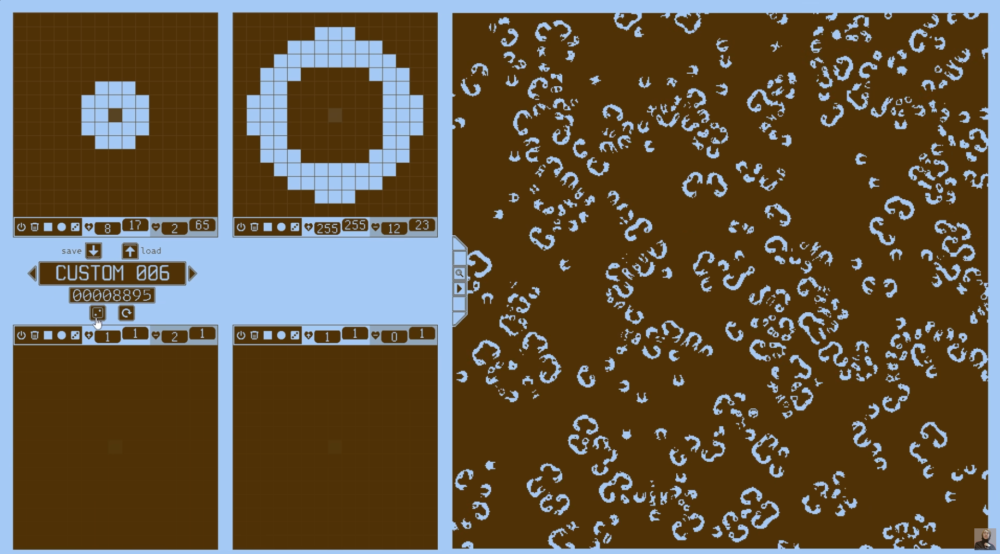

## MANOS PROJEKTWOCHE - GAME OF LIFE

- Montag bis Donnerstag 9 bis ... (13/14 Uhr)

### Montag

- https://youtu.be/TCLvGLA3WPM
- Github und git einrichten
- vs code einrichten
- Beginn Entwicklung game of life

### Dienstag

- Entwicklung game of life
- Was muss für das Plakat etc. gemacht werden?
- game of life patterns und Elemente anschauen

### Mittwoch

- Betrachtung anderer zellulärer Automaten
    - https://znah.net/graphs/
- grobe Planung der Plakats / Vortragsinhalte

### Donnerstang

- Vorbereitung Vortrag / Plakat
- Nerf battle

### Je nach Zeit

- Erweiterung game of life (siehe u.a. https://youtu.be/I1JBiZrZ_XM)
  
